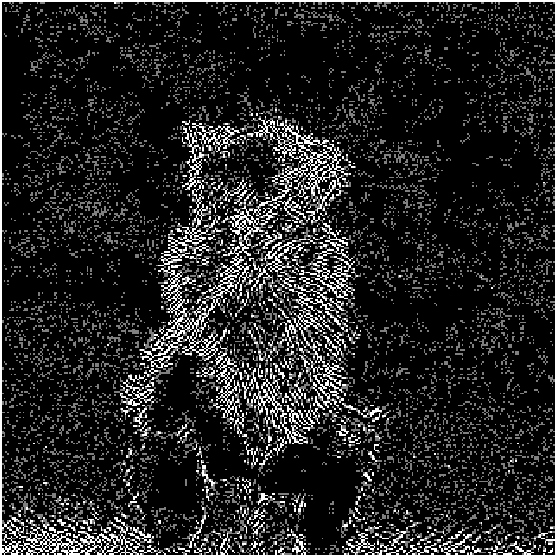
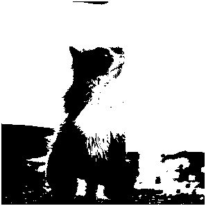
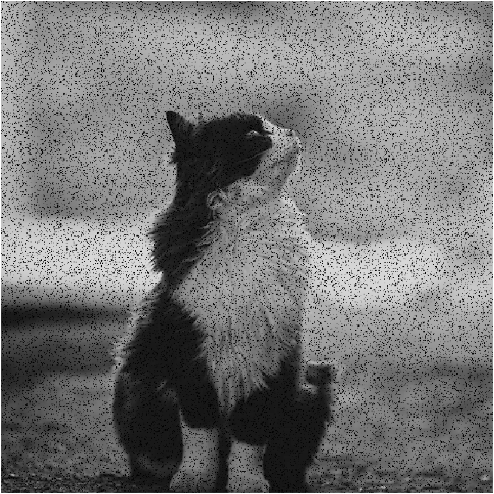

# Introduction to Incomplete Multi-view Weak-Label Learning

## What is "Incomplete Multi-View Learning"?

- To clarify what "Incomplete Multi-View Learning" is, we should first come out what "Multi-View  Learning" is. 
  - In many real-world applications, samples are often represented by several feature subsets. 
  
  - For example, as shown in Figure 1~3, a picture can be described by various visual features, such as histogram of oriented gradients, color features and scale invariant feature transform.
  
  - To handle such data, an effective way is proposed, named as "Multi-View Learning".
  
      

## What is "Weak-Label Learning"?

- To clarify what "Weak-Label Learning" is, we should first come out what "Multi-Label Learning" is.

  -  As shown in Figure 4, a scene image can be annotated with multiple tags {house, sky, tree, water}.
  - To handle such data, an effective way is proposed, named as "Multi-Label Learning".

  

## What is "Incomplete Multi-view Weak-Label Learning"?

- To clarify what "Incomplete Multi-view Weak-Label Learning" is, we should first come out what "Multi-View Multi-Label Learning" is.
  - When a kind of data  belongs to bot multi-view data and multi-label data,  it is named as multi-view multi-label data.
  - To handle this kind of data, an effective way is proposed, named as "Multi-View Multi-Label Learning"

## REFERENCES

